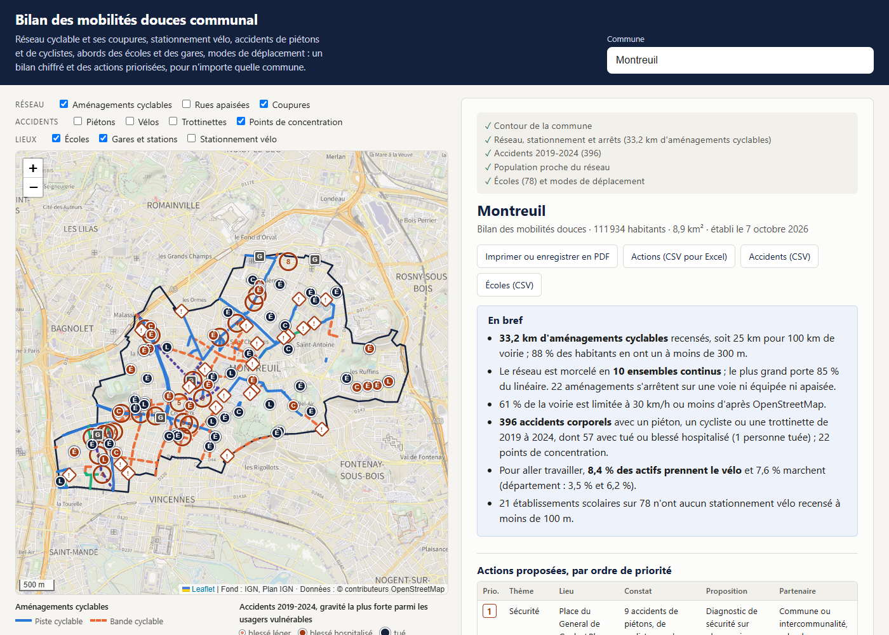

# Bilan des mobilités douces communal

Un site où l'on tape le nom d'une commune française pour obtenir, en moins d'une minute, une carte, un bilan chiffré et une liste d'actions priorisées sur les mobilités actives : réseau cyclable et ses coupures, rues apaisées, stationnement vélo, accidents de piétons et de cyclistes, abords des écoles et des gares, modes de déplacement vers le travail.

Il a été conçu pour préparer l'évaluation d'un plan communal de mobilités douces (par exemple un plan 2020-2026) : il compare le réseau d'aujourd'hui à celui du 1ᵉʳ janvier 2020.

## Lancer le site

Double-cliquer sur `ouvrir-le-site.bat` (il faut Python), puis choisir une commune. Lien direct par code INSEE : `http://127.0.0.1:8767/#93048` pour Montreuil.

Le site est statique (dossier `docs/`) : il peut être publié tel quel sur n'importe quel hébergement de pages.

## Ce que le bilan contient

| Rubrique | Indicateurs | Source |
|---|---|---|
| Réseau cyclable | Longueur par type (piste, bande, voie verte, couloir de bus), part des axes principaux équipés, part de la voirie à 30 km/h ou moins, double-sens cyclable | OpenStreetMap, lu au moment de la demande |
| Continuité | Nombre d'ensembles continus, fins d'aménagement sans suite, chaînons manquants de moins de 400 m | OpenStreetMap |
| Évolution depuis 2020 | Longueur par type au 1ᵉʳ janvier 2020 et aujourd'hui | Historique d'OpenStreetMap |
| Accidents | Accidents corporels avec piéton, cycliste ou trottinette de 2019 à 2024, par année et gravité, points de concentration | ONISR, fichiers BAAC |
| Écoles | Distance au réseau cyclable, rue apaisée ou non, stationnement vélo, accidents à proximité | INSEE, Base permanente des équipements 2025 |
| Stationnement et transports | Places de stationnement vélo, vélos en libre-service, gares et stations, part des habitants proches d'un arrêt | OpenStreetMap ; INSEE, carreaux de 200 m (Filosofi 2019) |
| Modes de déplacement | Mode principal pour aller travailler, comparé au département et à la France ; évolution 2016-2022 | INSEE, recensements 2022 et 2016 |
| Actions | Liste priorisée (sécurité, continuité, abords d'école, vélo et transports, double-sens cyclable), avec partenaire concerné | Règles fixes, les mêmes pour toutes les communes |

Trois exports : les actions (CSV lisible dans Excel, avec colonnes vides pour le coût, l'échéance et le pilote), les accidents et les écoles. Le bouton d'impression produit la note en PDF.

## Reconstruire les données

Les fichiers par département de `docs/data/` sont produits par quatre scripts R (`Rscript run_all.R`, depuis la racine du projet) à partir des sources placées dans `data-brut/` :

| Script | Source à télécharger | Emplacement |
|---|---|---|
| `R/01_accidents.R` | Fichiers caractéristiques, véhicules et usagers 2019 à 2024 du jeu « Bases de données annuelles des accidents corporels de la circulation routière » (data.gouv.fr) | `data-brut/baac/caract-2019.csv`, `vehicules-2019.csv`, `usagers-2019.csv`, etc. |
| `R/02_equipements.R` | Base permanente des équipements 2025 (INSEE), format parquet | `data-brut/BPE25.parquet`, ou celui du projet `diagnostic-climat-communal` |
| `R/03_parts_modales.R` | Base « Caractéristiques de l'emploi en 2022 », communes (INSEE) | `data-brut/base-cc-caract_emp-2022.CSV` |
| `R/04_population.R` | Carreaux déjà préparés par le projet voisin `diagnostic-climat-communal` | `../diagnostic-climat-communal/docs/data/carreaux/` |

## Choix de méthode

- **Longueur** : longueur de voie équipée. Une rue avec une bande de chaque côté compte une fois.
- **Continuité** : deux tronçons cyclables séparés de moins de 30 m sont considérés comme continus, ce qui correspond à la traversée d'un carrefour.
- **Coupure** : fin d'aménagement sans suite cyclable à moins de 30 m, qui débouche sur une voie sans aménagement et non limitée à 30 km/h. Une fin d'aménagement dans une rue apaisée n'est pas comptée.
- **Point de concentration** : au moins 4 accidents dans un rayon de 40 m en 6 ans.
- **Priorité 1** : point de concentration avec au moins trois accidents graves, chaînon manquant de moins de 200 m sur un axe principal, ou école cumulant au moins cinq points d'attention.

Tous ces seuils sont regroupés en tête de `docs/app.js`.

## Limites

- OpenStreetMap est une carte collaborative : ce qui n'y est pas dessiné n'est pas compté. Une rue à 30 km/h non renseignée apparaît comme non apaisée. Chaque constat est à vérifier sur le terrain.
- L'évolution depuis 2020 mêle les aménagements réellement créés et ceux qui existaient mais n'ont été cartographiés qu'après. Elle donne un ordre de grandeur.
- Les accidents sont ceux enregistrés par les forces de l'ordre. Les chutes de cyclistes seuls et les accidents légers sont très sous-déclarés.
- En 2016, l'INSEE ne séparait pas le vélo des deux-roues motorisés : l'évolution de la part du vélo seul n'est pas calculable.
- Les distances sont à vol d'oiseau. La fréquence des lignes de transport n'est pas analysée. Les coûts ne sont pas estimés.
- L'outil ne connaît pas le contenu du plan de la commune : il mesure l'état du territoire, à rapprocher ensuite des engagements pris.
- Le réseau est demandé à des serveurs publics d'OpenStreetMap, parfois saturés : le site réessaie seul, puis propose un bouton « Réessayer ». La comparaison avec 2020 prend une à trois minutes et peut échouer.
- Paris, Lyon et Marseille entières dépassent ce que ces serveurs acceptent en une demande.

## Vérifications faites

Essais de bout en bout dans Chrome le 7 octobre 2026 sur Montreuil, Rennes, Croissy-sur-Seine et Fort-de-France. Les totaux nationaux des accidents préparés sont cohérents avec les bilans de l'ONISR. Il n'y a pas de tests automatisés.
